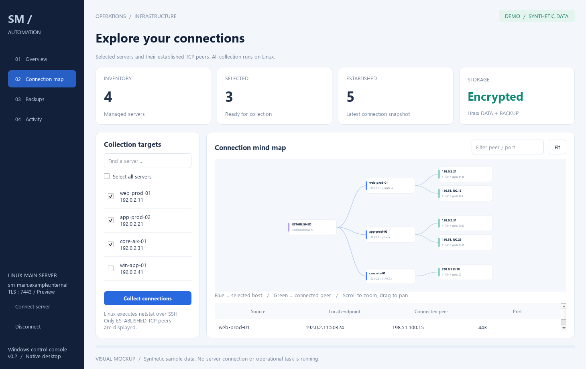
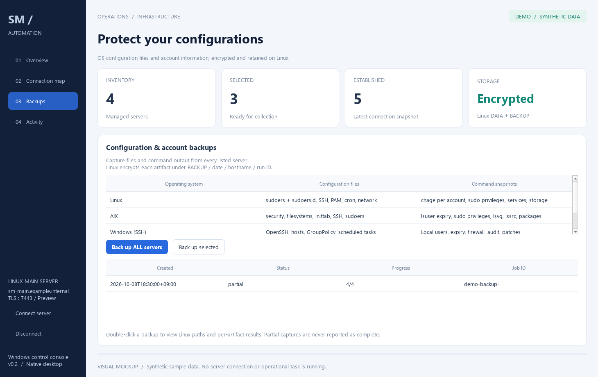
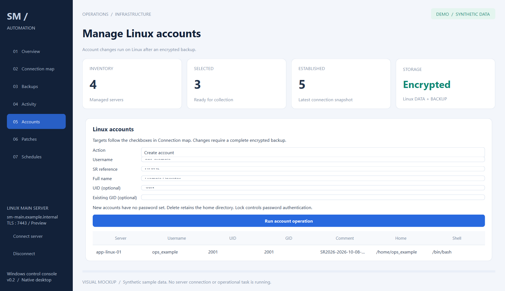
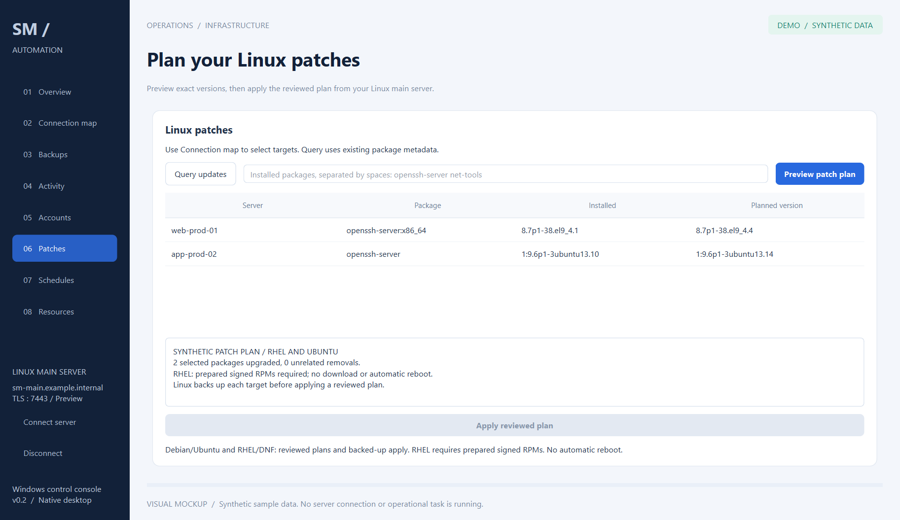
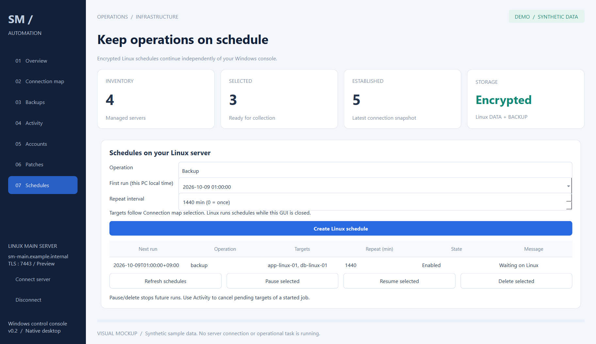
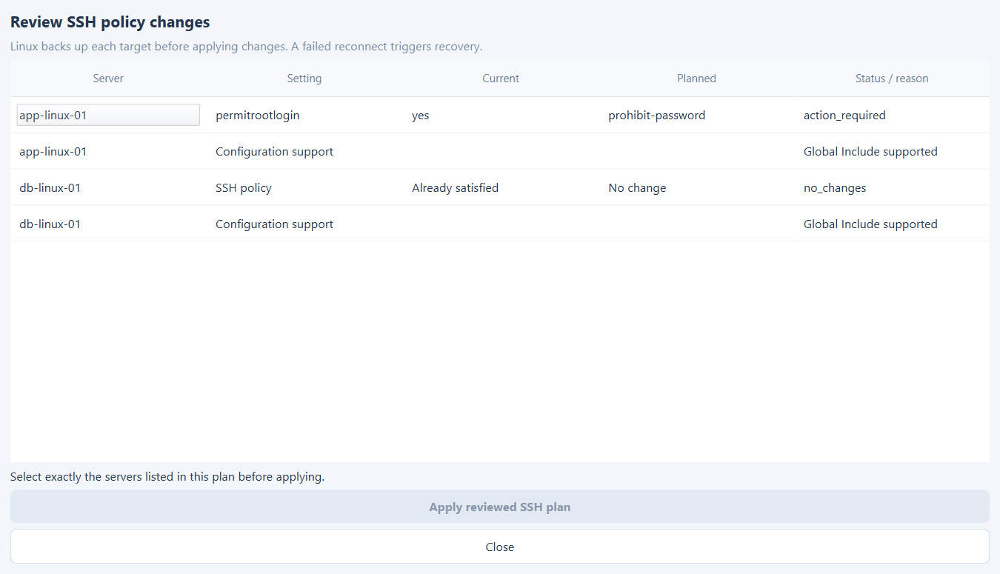
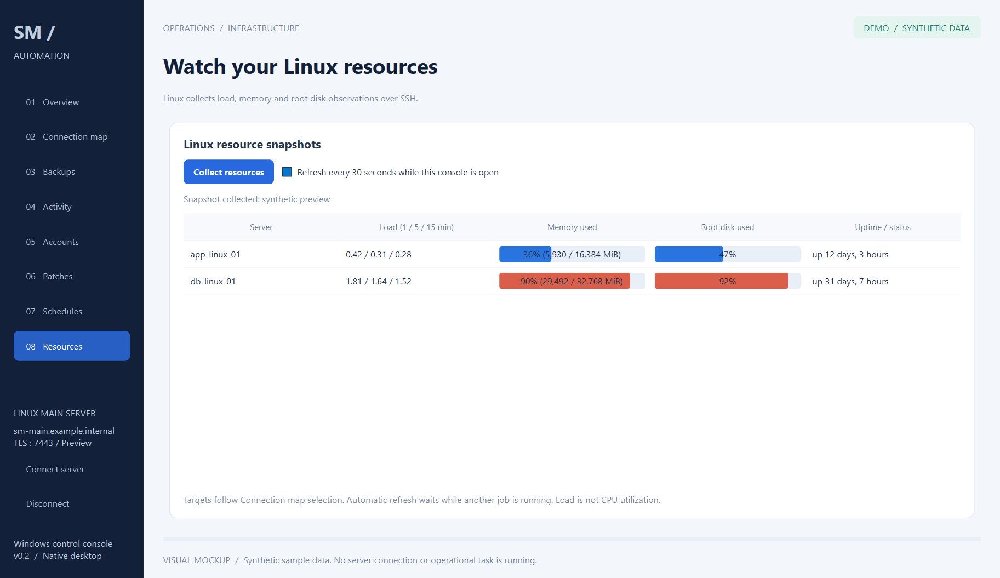

# SM_Automation

Linux 메인 서버와 Windows 네이티브 GUI로 구성한 중앙 OS 관리 시스템입니다.
**2026-10-08 아키텍처 변경 기준**이며 과거 Windows 컨트롤러/PostgreSQL 설계보다 우선합니다.

```text
Windows desktop GUI (PySide6)
        │ Dedicated TLS/TCP :7443 (not HTTP, not SSH tunneling)
        ▼
Linux main server ── encrypted DATA / BACKUP
        │ SSH :22
        ├── Linux / RHEL
        ├── AIX
        └── Windows OpenSSH / PowerShell
```

Windows는 대상 선택, 요청 전송, 진행 상황과 결과 표시만 합니다.
대상 서버 접속 자격 증명, 모든 수집·백업·암호화 저장은 Linux에서 관리합니다.
데이터베이스는 사용하지 않습니다.

Red Hat Enterprise Linux(RHEL)도 관리 대상 및 Linux 메인 서버 지원 범위에 포함합니다.
현재 Linux 공통 연결·백업·계정·자원 기능과 RPM/DNF 캐시 업데이트 조회를 연결했습니다.
RHEL 패치 버전 고정 계획·암호화 백업 후 적용 경로도 구현했습니다. 적용은 대상에 준비된 서명 RPM만 사용하며 실제 RHEL 검증은 아직 수행하지 않았습니다.

## 구현한 기능

- 인증서 검증 TLS와 접근 토큰으로 연결하는 전용 포트 서버/클라이언트
- 암호화된 서버 목록, 작업 이력 및 수집 결과; 기본 `./DATA`
- 비동기 작업, 서버별 진행/실패 상태, 재접속 후 이력 조회
- 선택/전체선택한 서버의 netstat ESTABLISHED 연결 수집과 네이티브 마인드맵
- Linux/AIX/Windows 주요 설정 파일 및 명령 출력 암호화 백업
- 백업 경로: `./BACKUP/YYYY-MM-DD/hostname/run-id/`
- 기존 Linux 자원 수집 및 보안 감사 호출
- Linux 계정 관리·공개키 등록, Debian/Ubuntu 및 RHEL 패치 계획·적용 경로, 예약 수집/백업
- SSH 정책 계획·암호화 백업 후 적용·재접속 실패 복구
- Windows 데스크톱 GUI: Overview, Connection map, Backups, Activity, Accounts, Patches, Schedules, Resources
- Linux 부하·메모리·디스크 자원 화면과 선택적 30초 갱신

## 시작 안내

1. [Linux 서버·Windows GUI 설치](docs/deployment.md)
2. [구조 및 통신 방식](docs/architecture.md)
3. [설정과 암호화 저장](docs/configuration.md)
4. [백업 대상 및 복원용 내보내기](docs/backups.md)
5. [다른 PC에서 이어가기 / 남은 작업](docs/pc-handoff.md)
6. [오프라인 패키지 준비](docs/offline-deployment.md)
7. [오늘의 개발 기록](docs/progress-2026-10-08.md)

GUI만 미리 보기:

```powershell
py -3.14 -m venv .venv-gui
.venv-gui/Scripts/python.exe -m pip install -r requirements-gui.txt
.venv-gui/Scripts/python.exe scripts/run_desktop.py --demo
```

실제 서버 연결은 `--demo` 없이 실행합니다. GUI에는 대상 서버 SSH 비밀번호를 입력하지 않습니다.

## GUI 목업

실제 GUI 코드를 예시 데이터로 렌더링한 화면이며 실서버 연결 결과가 아닙니다.









## 검증 상태

후속 사용자 지시에 따라 로컬 WSL Ubuntu root 서버에서 기존 테스트 **240개가 통과**했습니다.
Windows 클라이언트의 TLS 인증, 연결 수집, 자원 수집, 보안 감사, 암호화 백업과
네이티브 GUI의 선택·작업 요청·마인드맵 표시를 확인했습니다. AIX/Windows 대상 실환경은 미검증입니다.
실행 방법과 남은 작업은 [WSL 진행 기록](docs/wsl-progress.md)을 참조하세요.

이전 설계 대화는 [기록](docs/imported-central-os-conversation.md)으로 보존합니다.
