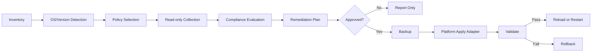

# 보안 정책 권고 아키텍처

## 목적

SM_Automation은 운영체제와 버전에 따라 보안 기준과 실행 방법이 다르므로,
정책 파일과 플랫폼별 처리 모듈을 분리합니다.

## 정책 파일 구조

```text
config/
  security-policy-rhel8.json
  security-policy-rhel9.json
  security-policy-aix7.1.json
  security-policy-windows2022.json
  security-policy-postgresql.json
```

정책 파일은 기준값과 적용 조건만 보유합니다. SSH 명령, PowerShell 명령,
AIX 명령은 정책 파일에 직접 넣지 않고 플랫폼 어댑터가 관리합니다.

## 배포 모델

SM_Automation은 중앙 관리용 **컨트롤러**에 설치합니다. 현재 개발 환경은
Windows이며, 향후 고객사 운영 패키지도 Windows Server 또는 Windows 관리용
PC에 설치할 수 있도록 Python 표준 라이브러리와 Windows 호환 패키지를
기본으로 사용합니다.

```text
Windows Controller
  ├─ Linux/RHEL 대상: Paramiko SSH
  ├─ AIX 대상: Paramiko SSH 및 AIX 전용 어댑터
  ├─ Windows 대상: WinRM/PowerShell 어댑터
  └─ CMDB: 원격 또는 로컬 PostgreSQL
```

컨트롤러 운영체제와 관리 대상 운영체제는 서로 다를 수 있습니다. 따라서
Windows에서 실행된다고 Linux 명령을 로컬에서 실행하지 않으며, 원격 대상에
접속한 뒤 대상 OS 전용 명령을 실행합니다.

## 처리 흐름



## 계층별 책임

| 계층 | 책임 | 현재 상태 |
| --- | --- | --- |
| Inventory | hostname, IP, OS 목록 검증 | 구현 완료 |
| SSH Engine | Linux/AIX SSH 접속 및 원격 명령 | 구현 완료 |
| WinRM Adapter | Windows Server 원격 접속 | 정책 파일만 준비 |
| Policy Registry | OS/버전별 JSON 선택 | 파일 기준 운영 |
| Collector | 서버의 실제 설정과 상태 수집 | SSH 기본/보안 일부 구현 |
| Evaluator | 실제값과 정책값 비교 | SSH 기준 구현 |
| Remediation Plan | 변경 대상과 현재/권고값 생성 | 구현 완료 |
| Apply Adapter | 백업, 변경, 검증, reload | SSH 설정 일부 구현 |
| Rollback | 검증 실패 시 원상복구 | SSH 설정 적용에 포함 |
| Monitoring | 자원 메트릭 수집 | 보류, node-exporter 예정 |
| CMDB Repository | PostgreSQL 자산/관계/감사 데이터 저장 | 아키텍처 및 스키마 추가 |

## 현재 구현 범위

- Windows 컨트롤러에서 Linux/RHEL 원격 SSH 수집, 평가, 계획 실행을 검증했습니다.
- AIX와 Windows 대상은 정책 파일과 설계 기준을 준비했으며, 전용 실행 어댑터는
  추가 구현이 필요합니다.
- Windows 로컬 PostgreSQL 재현은 PowerShell 스크립트로 제공합니다.
- Linux/AIX 대상의 원격 PostgreSQL 접속은 네트워크와 PostgreSQL 서버 정책이
  허용된 경우에만 동작합니다.

## 플랫폼별 적용 원칙

### RHEL 8/9

- `firewalld`와 SELinux 기준은 고객사 승인값을 사용합니다.
- `authselect` 관리 파일은 직접 편집하지 않습니다.
- `faillock`, `pwquality`, SSSD는 실제 사용 여부를 먼저 확인합니다.
- systemd 서비스와 socket은 `/etc/services` 편집으로 대체하지 않습니다.

### AIX 7.1

- `/etc/security/user`, `/etc/security/passwd`, `/etc/inetd.conf` 등 AIX
  고유 경로를 사용합니다.
- `systemctl`, `authselect`, `faillock`, SELinux, SSSD 명령은 사용하지
  않습니다.
- 계정 제거와 네트워크 필터 변경은 애플리케이션 의존성을 검토합니다.

### Windows Server 2022

- PowerShell/WinRM 기반 수집 및 적용 어댑터를 별도로 구현합니다.
- Windows Firewall, Defender, UAC, RDP, SMB, TLS, 감사 정책을 Windows
  정책 파일 기준으로 평가합니다.
- Linux SSH 명령이나 AIX 파일 경로를 재사용하지 않습니다.

## 적용 승인 게이트

1. 정책 파일과 고객사 기준을 승인합니다.
2. 읽기 전용 감사 결과를 생성합니다.
3. 준수 평가와 변경 계획을 검토합니다.
4. 변경 대상, 영향, 백업 위치, rollback 방법을 확인합니다.
5. 승인된 대상에 한해 플랫폼 적용 어댑터를 실행합니다.
6. 설정 검증과 재접속을 수행합니다.
7. 결과 보고서를 저장합니다.

현재 구현은 이 흐름 중 수집, 평가, 계획, 일부 SSH 적용까지 제공합니다.
RHEL 전체 기준 적용과 Windows/AIX 실행 어댑터는 별도 단계로 확장합니다.

## PostgreSQL CMDB 보안

- CMDB 연결은 전용 애플리케이션 계정과 `sslmode=verify-full`을 사용합니다.
- 애플리케이션 계정에는 superuser, CREATEDB, CREATEROLE 권한을 부여하지
  않습니다.
- 원격 접근은 사설 관리망과 허용된 클라이언트만 허용합니다.
- `pg_hba.conf`는 deny-by-default와 `scram-sha-256`을 기준으로 합니다.
- 비밀번호는 저장소와 JSON에 저장하지 않고 환경변수 또는 Secret Manager를
  사용합니다.
- 초기 스키마는 [config/cmdb-schema.sql](../config/cmdb-schema.sql)이며,
  변경은 승인된 migration으로 관리합니다.
- 원격 TEST1 PostgreSQL은 검증과 초기 스키마 적용 대상이며, 향후 로컬
  PostgreSQL은 [scripts/setup_local_postgresql.ps1](../scripts/setup_local_postgresql.ps1)로
  동일한 DB/역할/스키마 구성을 재현합니다.
- PostgreSQL 보안 기준은
  [config/security-policy-postgresql.json](../config/security-policy-postgresql.json)에
  저장합니다.
